# Home Lab Architecture

```mermaid
graph TD
    operator(["Operator<br/>(Host Machine)"])

    operator -- "terraform apply" --> tf
    operator -- "op read → SSH keys" --> op
    operator -- "op read → kubeconfig" --> op
    operator -- "kubectl" --> k3s
    operator -- "SSH" --> k3s_vm
    operator -- "SSH" --> wazuh_vm
    operator -- "Browser" --> wazuh_dash

    subgraph op["1Password"]
        direction LR
        op_proxmox["Proxmox API Credentials"]
        op_k3s["K3S VM Secrets<br/>SSH Key / Password / Kubeconfig"]
        op_wazuh["Wazuh VM Secrets<br/>SSH Key / Password"]
        op_vault["Vault Cluster Keys<br/>Root Token / Unseal Keys"]
        op_pki["Vault PKI Root CA"]
        op_fleet["Fleet Credentials<br/>MySQL / Redis Passwords"]
    end

    subgraph tf["Terraform"]
        direction LR
        tf_base["Base Module<br/>VM Template"]
        tf_k3s["K3S Module"]
        tf_wazuh["Wazuh Module"]
        tf_unifi["UniFi Module"]
        tf_vault["Vault Module"]
        tf_cm["cert-manager Module"]
        tf_fleet["Fleet Module"]
    end

    op_proxmox -. "reads credentials" .-> tf_base
    op_proxmox -. "reads credentials" .-> tf_k3s
    op_proxmox -. "reads credentials" .-> tf_wazuh

    tf_k3s -- "stores SSH key +<br/>password + kubeconfig" --> op_k3s
    tf_wazuh -- "stores SSH key +<br/>password" --> op_wazuh
    tf_vault -- "stores unseal keys +<br/>root token + CA cert" --> op_vault
    tf_vault -- "stores PKI root CA" --> op_pki
    tf_fleet -- "stores MySQL +<br/>Redis passwords" --> op_fleet

    tf -- "state" --> gh[("GitHub Repos<br/>terraform-backend-git")]

    subgraph infra["Infrastructure"]
        direction TB

        subgraph proxmox["Proxmox VE"]
            template["Ubuntu 24.04 Template<br/>cloud-init"]
            k3s_vm["K3S VM"]
            wazuh_vm["Wazuh VM"]
            template -. "clone" .-> k3s_vm
            template -. "clone" .-> wazuh_vm
        end

        subgraph k3s_cluster["K3S Cluster"]
            k3s["Server Node<br/>(VM, amd64)"]
            rpi["Worker Node<br/>(Raspberry Pi, arm64)"]
            traefik["Traefik Ingress<br/>(TLS termination)"]
            vault_svc["HashiCorp Vault"]
            cm_svc["cert-manager"]
            fleet_svc["FleetDM"]
            fleet_mysql["MySQL"]
            fleet_redis["Redis"]
            k3s --- traefik
            rpi -- "joins" --> k3s
            vault_svc -- "PKI signs certs" --> cm_svc
            cm_svc -- "issues TLS" --> traefik
            fleet_svc --> fleet_mysql
            fleet_svc --> fleet_redis
        end

        subgraph wazuh["Wazuh (All-in-One)"]
            wazuh_mgr["Manager"]
            wazuh_idx["Indexer"]
            wazuh_dash["Dashboard"]
        end

        subgraph unifi["UniFi Network"]
            direction LR
            vlan_home["Home VLAN"]
            vlan_servers["Servers VLAN"]
            vlan_guest["Guest VLAN"]
            vlan_iot["IoT VLAN"]
        end

        dns["DNS Server"]
    end

    tf_base -- "creates" --> template
    tf_k3s -- "provisions + Ansible" --> k3s_vm
    tf_wazuh -- "provisions + Ansible" --> wazuh_vm
    tf_unifi -- "manages" --> unifi
    tf_vault -- "Helm + init + PKI" --> vault_svc
    tf_cm -- "Helm + Vault issuer" --> cm_svc
    tf_fleet -- "Helm + MySQL + Redis" --> fleet_svc

    k3s_vm --> k3s
    wazuh_vm --> wazuh

    k3s_cluster ~~~ vlan_servers
    wazuh ~~~ vlan_servers
    dns ~~~ vlan_servers

    classDef operator fill:#e8710a,stroke:#c45d08,color:#fff
    classDef vault fill:#1a73e8,stroke:#1557b0,color:#fff
    classDef terraform fill:#7b42bc,stroke:#5c2d91,color:#fff
    classDef infra fill:#34a853,stroke:#2d8f47,color:#fff
    classDef network fill:#fbbc04,stroke:#e0a800,color:#000
    classDef github fill:#24292e,stroke:#1b1f23,color:#fff

    class operator operator
    class op,op_proxmox,op_k3s,op_wazuh,op_vault,op_pki,op_fleet vault
    class tf,tf_base,tf_k3s,tf_wazuh,tf_unifi,tf_vault,tf_cm,tf_fleet terraform
    class proxmox,k3s_vm,wazuh_vm,k3s_cluster,wazuh infra
    class vlan_home,vlan_servers,vlan_guest,vlan_iot network
    class gh github
```



## How It Works

Everything is driven from the **host machine**. The operator interacts with two systems:

1. **Terraform** provisions and configures all infrastructure
2. **1Password** stores and serves every secret -- nothing on disk, nothing in code

### Provisioning Flow

```
Operator → terraform apply
              ├── reads Proxmox API creds from 1Password
              ├── creates VM template (base module)
              ├── clones VMs, runs Ansible to install K3S / Wazuh
              ├── stores generated SSH keys + passwords in 1Password
              ├── fetches kubeconfig from K3S, stores in 1Password
              ├── manages UniFi VLANs and WLANs
              ├── deploys Vault via Helm, initializes + unseals, configures PKI engine
              ├── deploys cert-manager via Helm, creates Vault-backed ClusterIssuer
              ├── deploys FleetDM via Helm with in-cluster MySQL + Redis
              └── persists state to GitHub via terraform-backend-git
```

### Access Flow

```
Operator → op read (SSH key) → SSH to VM
Operator → op read (kubeconfig) → kubectl to K3S cluster
Operator → browser → Wazuh Dashboard
Operator → browser → Vault UI (https://vault.10.0.0.2.nip.io)
Operator → browser → Fleet UI (https://fleet.10.0.0.2.nip.io)
```

### K3S Services

All services on K3S are deployed via Terraform Helm releases. Kubeconfig is pulled from 1Password at plan time.

**HashiCorp Vault** (`./terraform.sh vault`)
- Deployed via Helm, auto-initialized and auto-unsealed on first apply
- Unseal keys and root token stored in 1Password
- PKI secrets engine provides a 10-year internal root CA (HomeLab Root CA)
- Kubernetes auth allows cert-manager to request certificates without static tokens

**cert-manager** (`./terraform.sh cert-manager`)
- Deployed via Helm with CRDs
- `vault-pki` ClusterIssuer delegates certificate signing to Vault's PKI engine
- Ingress-shim auto-creates certificates for any Ingress annotated with `cert-manager.io/cluster-issuer: vault-pki`

**FleetDM** (`./terraform.sh fleet`)
- Deployed via Helm with in-cluster MySQL and Redis (Bitnami charts)
- Credentials generated by Terraform and stored in 1Password
- All pods pinned to amd64 nodes via `nodeSelector`
- TLS terminated at Traefik using Vault-signed certificates

### TLS Certificate Flow

```
Ingress (annotation: vault-pki)
  → cert-manager detects annotation
  → authenticates to Vault via K8s ServiceAccount
  → sends CSR to Vault PKI (pki/sign/homelab)
  → Vault signs with HomeLab Root CA, returns cert + chain
  → cert-manager stores in K8s TLS Secret
  → Traefik terminates TLS using that secret
```

Certificates auto-renew at 2/3 of lifetime (~60 days). Vault must be unsealed for issuance and renewal.

## Secret Management

| Direction | Mechanism | What |
|-----------|-----------|------|
| **Read** | `data "onepassword_item"` | Proxmox API credentials, kubeconfig for K3S provider |
| **Write** | `resource "onepassword_item"` | VM SSH keys and passwords at creation time |
| **Write** | `op item edit` (CLI) | Kubeconfig, Vault unseal keys, PKI root CA, Fleet creds |
| **Read** | `op item get --reveal` (CLI) | Vault root token for PKI setup |
| **Read** | `op read` (CLI) | Operator retrieves SSH keys and kubeconfig |

No secrets in `.tfvars`, no `.pem` files on disk, no plain text in the repo.

## Access Patterns

| What | How | 1Password Path |
|------|-----|----------------|
| SSH to K3S VM | Shell function with temp key | `op://<vault>/K3S VM/SSH Key/private_key` |
| SSH to Wazuh VM | Shell function with temp key | `op://<vault>/Wazuh VM/SSH Key/private_key` |
| kubectl to K3S | `op read` to kubeconfig file | `op://<vault>/K3S VM/Kubeconfig/kubeconfig` |
| Terraform apply | `OP_SERVICE_ACCOUNT_TOKEN` env var | Proxmox API creds via data source |
| Wazuh Dashboard | Browser (HTTPS) | Credentials on the VM post-install |
| Vault UI | Browser (HTTPS) | `op://<vault>/Vault Cluster Keys/root_token` |
| Fleet UI | Browser (HTTPS) | Setup via web UI on first access |
| Vault unseal | `vault operator unseal` | `op://<vault>/Vault Cluster Keys/unseal_keys` |

## Network Topology

| VLAN | Purpose | SSID | Notes |
|------|---------|------|-------|
| 0 | Home | Home SSID | Personal devices |
| 2 | Servers | Servers SSID | Proxmox, K3S, Wazuh, DNS, Pi |
| 3 | Guest | Guest SSID | Isolated guest access |
| 4 | IoT | IoT SSID | 2.4GHz only, isolated |
